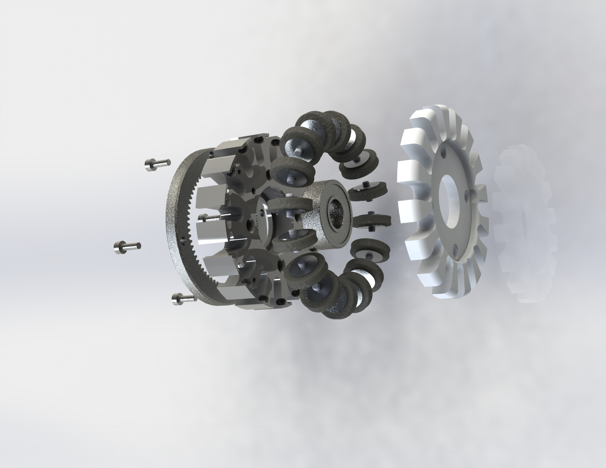
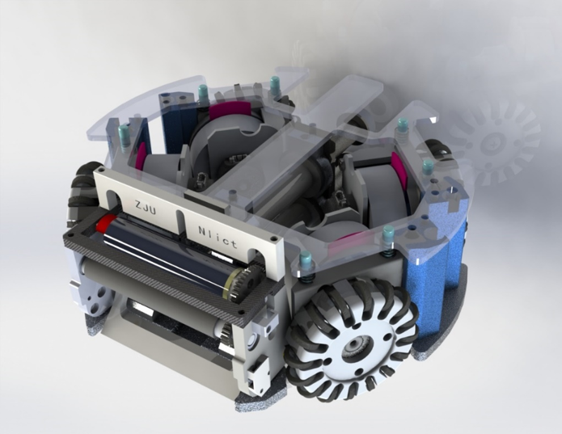
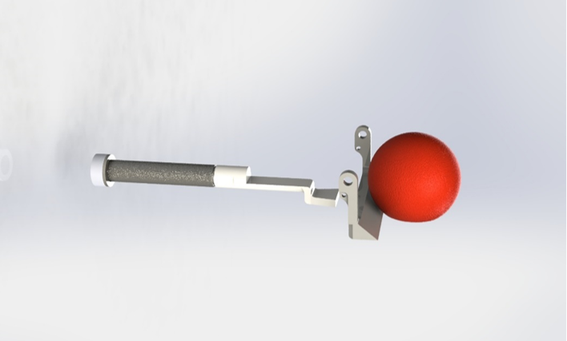
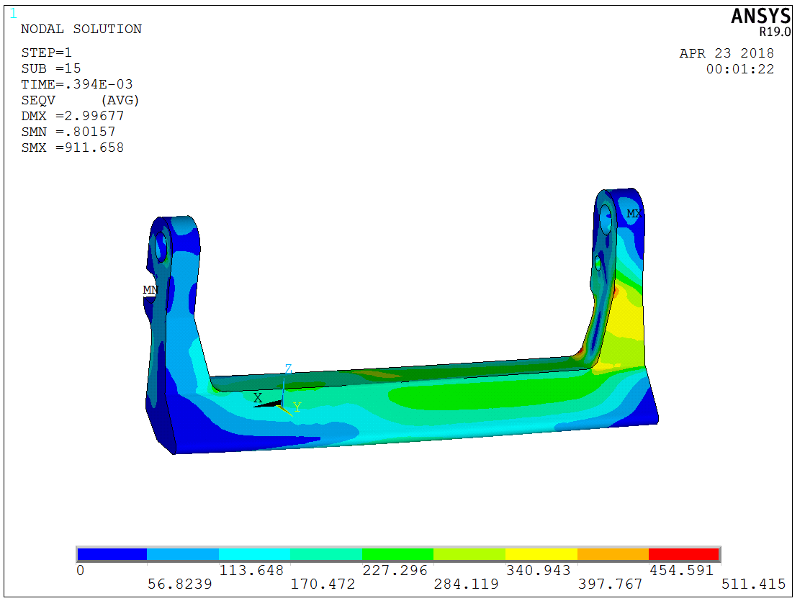
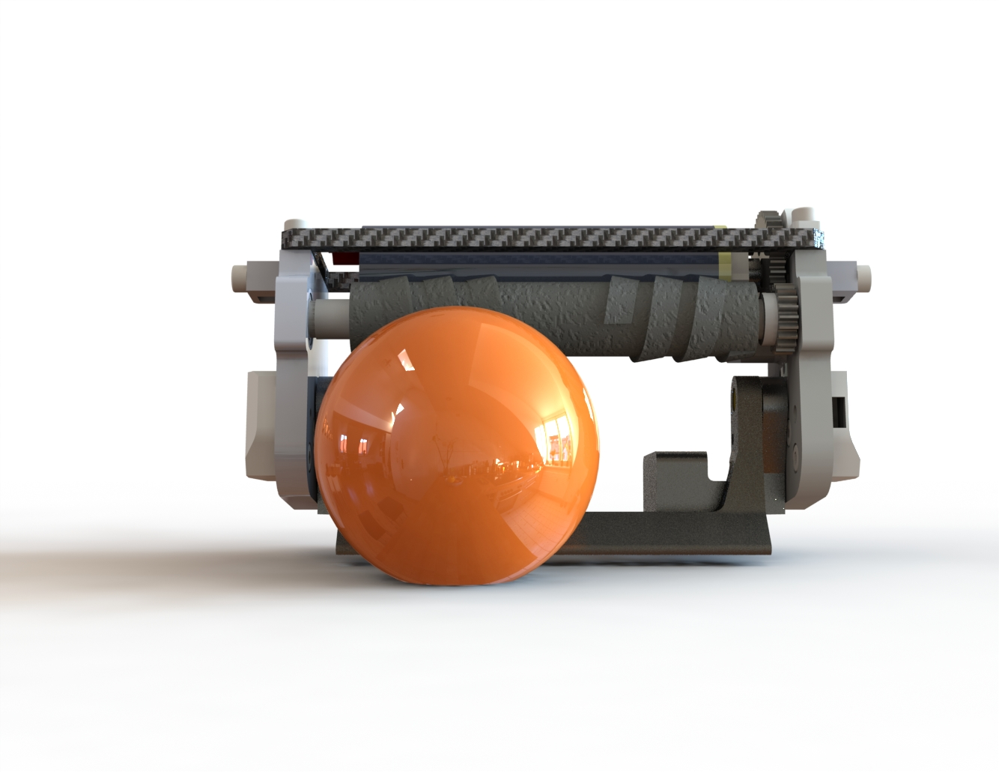
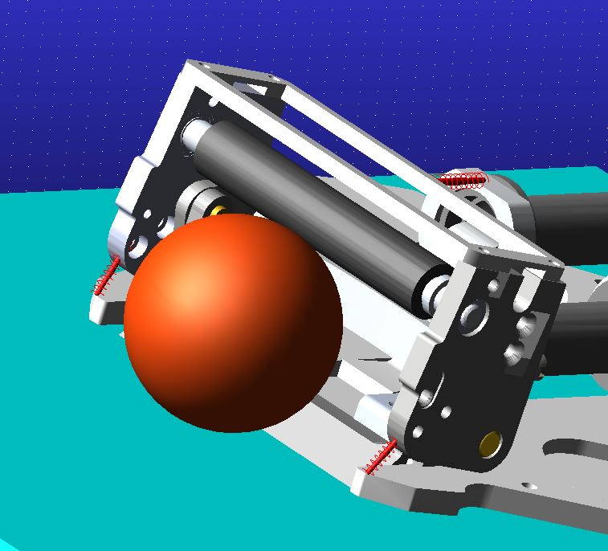

# 小型足球机器人--机械组

## 产品主要特性

作为硬件的一部分，机械性能在整个机器人比赛中也起着至关重要的作用。

经过多年的技术迭代，浙江大学ZJUNlict机器人机械结构至今已发展为模块化产品，具体来讲分为骨架模块、运动模块、平挑射模块、嘴巴模块。各个模块各司其职，在可快速拆卸的同时协同工作，使得机器人可以平稳的以高性能运行。

## 模块分析

* **骨架模块**：作为整个机器人的支撑，其坚固性极为重要。骨架模块包括几大部件：下板（铝合金7075）、上板（碳纤维）、支撑铝柱、电池架、以及外壳（我们称之为帽子）。其中为了保持机器人的下盘稳定，我们将下板加厚处理的同时，上板采用碳板设计。对于电池架，我们采用3D打印，为机器人减重的同时保证一定的坚固性。
* **运动模块**：通俗的来说，运动模块就是运动电机减速箱、运动电机、大轮、以及嵌入在大轮中的小轮的总称。这部分在我们机器人执行接收到的命令方面至关重要，也是需要改进的部分。这一部分在今年做了一些修改，比如将整个减速箱厚度减小，运动电机轴长修改，编码器的更换等，但同时也出现了一些问题，比如中间POM件的强度严重不足。将来对运动模块需要做出较大的调整，一方面将减速箱设计得更为简洁，另一方面将整个轮子设计得更小，以便为其他部分留下更大的空间。

* **平挑射模块**：该模块由两个电磁线圈构成，通电后，线圈的电磁感应效应会将线圈中的铁芯快速推出，再配合嘴巴模块中的部件，完成平射或者挑射。以往，我们执迷于如何将踢球速度（铁芯射出速度）无止境提升，然而现在的规则越来越限制踢球速度，而且目前看来，对踢球速度越来越严格的限制将会是以后的一个趋势。故此模块的改进方向不在于力度的提升，而在于机构简洁性与可靠性的提升：简洁性是指考虑将圆形铁芯更换为方形以减小体积，可靠性是指在机械结构设计上解决目前机器人存在的踢球力度不稳定的问题。

* **嘴巴模块**：作为整个机器人中最复杂的模块，它包括吸球电机、吸球电机架、吸球杆、吸球螺纹橡胶管、挑射导轨、以及挑射铲。整个嘴巴可以说是我们最自豪的一个模块，吸球的强力以及挑射铲的稳定结构也可以说是为ZJUNlict的夺冠保驾护航。在对嘴巴结构的修改上，我们由以往的试样生产实验到如今未完全成型的计算机仿真实验，可以说是跨出了一大步。例如在对挑射铲重新设计这一点上，我们通过仿真不断对产品重新设计，直到达到强度要求。未来这一模块的改进方向将是进一步提高其控球能力，一方面增大电机功率并且提高减速比，另一方面改进其后方的弹簧阻尼系统，使其对不同环境具有更好的通用性。

## 关键技术

* 随着机械组的不断改进，对于队员计算机辅助设计软件使用能力的要求越来越高，如Solidworks、AutoCAD、ADAMS、ANSYS等等。
* 作为机械组的成员，深入了解机器人中每个部件是很重要，但与此同时，我们也需要了解一些必要的电路知识，以辅助电路组。

## 路线计划

* 对2019的机械版本进行相关的修正和改进；
* 重新设计运动模块，包括设计电机减速箱和车轮；
* 重新设计控球电机减速装置，以及调整吸球嘴的自由度，增强吸球能力；
* 参考其他队伍的机械版本，设计几款样车，学习其优点；

