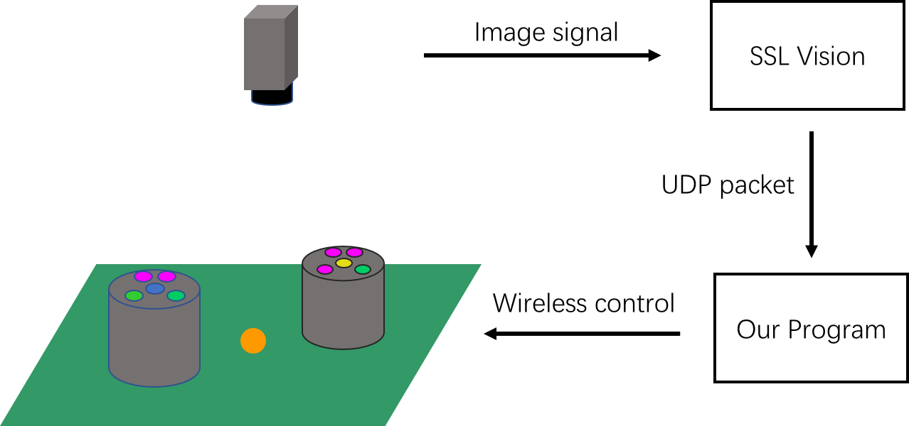

# ZJUNlict队伍介绍

## 1. 比赛介绍

### 1.1 什么是[RoboCup](http://www.robocup.org/)？
**机器人世界杯 RoboCup**是为促进人工智能和机器人等相关领域研究的一个国际项目，是**世界上最大的机器人比赛**。它为人工智能机器人研究提供了广泛的技术标准问题，能够被综合和检验。该机器人项目的[最终目标](http://www.robocup.org/objective)是:到2050年，开发完全自主仿人机器人队，能赢得对人类足球世界冠军队。

**简而言之**，RoboCup是一个以足球机器人为主要研究平台，以推进人工智能和机器人研究的国际比赛。

RoboCup作为目前全球三大机器人比赛联盟（另两个分别是World Robot Olympiad（WRO）、FIRST Lego League（FLL）），也是这三个赛事中学术研究成分最高的一个。机器人世界杯的概念是于1993年提出的，经过2年的可行性考察，于1995年8月， 组织委员会正式宣布将举行世界性的机器人交流和机器人足球赛。1997年7月， 首届机器人世界杯大赛在日本名古屋举行。如今，RoboCup早已成为国际机器人行业的盛会，每年的活动都吸引了大量的科技工作人员和对机器人感兴趣的人士参与。

RoboCup的比赛项目主要有机器人足球、机器人救援和机器人家用三个组别，而机器人足球组作为RoboCup的元老组别，也是**参与人数和知名度最高的组别**。

具体细分，机器人足球根据机器人形态，大小又可以分为仿人组（Humanoid League,机器人为双足式，根据大小细分为kid-size、teen-size、adult-size），中型组（Middle Size League，机器人为轮式，体型较大，比赛4V4），**小型组(Small Size League，机器人为轮式，体型较小，比赛11V11)**，标准平台（使用NAO机器人），仿真组等。

关于RoboCup的更多信息[参阅这里](https://en.wikipedia.org/wiki/RoboCup)。

 ### 1.2 什么是RoboCup Small Size League（SSL）？

ZJUNlict所在的小型组(Small Size League），是RoboCup历史最为悠久的组别，事实上，第一届RoboCup就发轫于小型组。和其他组别相比，小型组的最大特点就是**高动态性和高对抗性**。由于机器人体积较小，机器人移动速度可以达到4m/s以上，球速更是可达6.5m/s。同时由于比赛机器人较多，可以像人类足球比赛一样，有很漂亮的传球和配合。因此，小型组也被称为“RoboCup比赛中最为激烈也最为好看的组别”。

RoboCup为了推进机器人行业发展，规则并不是一成不变的，每个组别的难度都会随着时间不断加大。以小型组为例，从第一届RoboCup小型组的场地只有一个台球桌这么大，场上每队只有两个机器人。发展至今，小型组的场地规模已经达到了12米长9米宽，每队机器人数量也增加到了11个。

关于小型组的更多介绍[参阅这里](https://ssl.robocup.org/)。

## 2. 队伍介绍

ZJUNlict成立于**2003年**，依托于浙江大学控制学院工业控制国家重点实验室（Zhejiang University National Laboratory of Industrial Control Technology），由熊蓉教授指导，经过一代代ZJUNlicter的不断努力，我们不断追赶和卡耐基梅隆大学、康奈尔大学等老牌世界强队的差距，从中国公开赛一步步迈向世界赛。

在2012年6月中旬墨西哥的比赛中，我们厚积薄发，取得了国际亚军，由一支传统劲旅晋升为了豪门强队。2013年经过精心准备，于六月在荷兰一路斩各国强队于马下，力克群雄终夺冠，实现了小型组的十年梦想！2014年，巴西若昂佩索阿，强队云集，我们走过坎坷的卫冕之路，决赛中2:0虐杀CMU，再次问鼎！2017年，我们在伊朗公开赛上夺得冠军，在暑期的名古屋世界杯半决赛一球惜败，但我们在随后的三四名决赛中没有慌乱，还是稳稳地夺得了季军。 2018年6月在加拿大，面对新兴崛起的德国、伊朗强队以及整装归来的CMU，我们在淘汰赛第一轮就掉入了败者组的不利情形下，团队成员通力协作，不断调试机器人，迭代升级，在接下来的败者组的比赛中连胜三局，以败者组冠军的身份和CMU会师决赛，最终以4：0的大胜夺得了久违的世界冠军。2019年7月的悉尼世界杯中，由于我们充分的赛前准备，在比赛中我们所向披靡，以全胜并只失一粒点球的方式蝉联该项目的冠军！

**RoboCup SSL荣誉榜**

| Rank | Team            | Country  | 1st               | 2nd                  | 3rd         |
| ---- | --------------- | -------- | ----------------- | -------------------- | ----------- |
| 1    | CMμs            | USA      | 5(97,98,06,07,15) | 6(08,10,13,14,16,18) |             |
| 2    | ZJUNlict        | China    | 4(13,14,18,19)    | 1(12)                | 3(15,16,17) |
| 3    | Cornell Big Red | USA      | 4(99,00,02,03)    | 1(05)                |             |
| 4    | Skuba           | Thailand | 4(09,10,11,12)    |                      | 1(08)       |

[实验室环境介绍](Lab.md)

## 3. 队伍分组

ZJUNlict取得今天成绩是所有成员一代代努力和精诚合作的结果，目前队伍内分为机械、电路、软件三个组别。

### 3.1 硬件组

硬件组主要分为机械与电路两个方向。

- 机械决定了我们的机器人是否足够“强壮”，能否在激烈的对抗中能否占得先机。在这里你有充分的机会将自己的想法转换成实物，在设计阶段辅助以强大的CAD软件以及运动学和动力学仿真软件，在制造阶段体验机械加工，亲手装配上百个零部件。整个机械设计以及加工流程接近工业化标准，能够非常好的培养真正的工程能力。 [点击查看详细介绍](Mechanics.md)

- 电路组的主要工作是电路原理图设计、PCB设计焊接调试、嵌入式程序开发、机器人日常维护等。 今年我们将对电路部分进行比较大的改进，预计将会对无刷直流电机的控制效果有较大的提升。 涉及的知识有模电数电原理、PCB设计原理、嵌入式编程语言等。[点击查看详细介绍](Electrics.md)

### 3.2 软件组

- 策略：场上的指挥官，根据瞬息万变的局势做出此刻的攻防策略。 这一年我们将继续进行对策略层动态的改造，融入更多与模式识别相关的内容，使机器人在场上能够自动地做出调整。我们希望喜欢足球的同学们能够帮助改进策略上的一些细节问题。   
- 软件： 策略的眼睛，通过图像处理、比赛仿真等软件推动机器人的运转。 我们计划将我们现在运行的各个软件跨平台，方便同学们更方便地加入到工作当中，同时改进我们的仿真系统以及整体代码的架构。   
- 车控： 策略的双手，将策略的命令分解为更细小的动作，下发至硬件层执行。 今年我们将会对底层的控制算法进行改进，从而使机器人的运动更加准确和稳定，使策略层做出的决定能够更好地在赛场上被实现。 

[点击查看详细介绍](Software.md)
